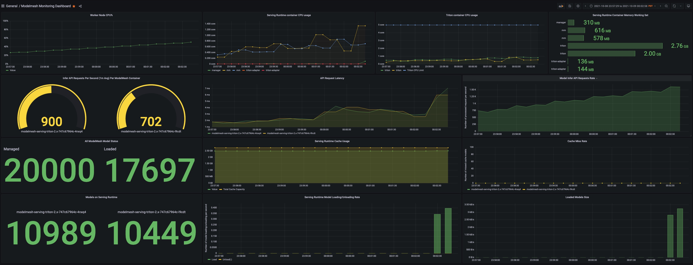

## Introduction
The ModelMesh serving runtime pods expose metrics HTTP endpoints, `/metrics` and on port `2112`, by default. The best way to see metrics is to run prometheus to collect metrics from targets by scraping the metrics HTTP endpoints and visualize it in a Grafana dashboard.

The steps involves:
1. [Setup Prometheus Operator](#Setup-Prometheus-Operator)
2. [Apply ServiceMonitor custom resource](#Create-ServiceMonitor-CRD)
3. [Create Grafana dashboard](#Import-Grafana-Dashboard)
## Setup Prometheus Operator
The Prometheus Operator is the easiest way to setup both Prometheus and Grafana natively in a Kubernetes cluster. Please setup using the [Quickstart](https://github.com/prometheus-operator/kube-prometheus#quickstart) instruction.

By default, the operator setups RBAC rules to enable monitoring the `default` and `kube-system` namespaces to collect Kubernetes and node metrics.

To monitor the `modelmeash-serving` namespace, add the following to the the `manifests/prometheus-roleBindingSpecificNamespaces.yaml`:

```yaml
- apiVersion: rbac.authorization.k8s.io/v1
  kind: RoleBinding
  metadata:
    labels:
      app.kubernetes.io/component: prometheus
      app.kubernetes.io/name: prometheus
      app.kubernetes.io/part-of: kube-prometheus
      app.kubernetes.io/version: 2.30.2
    name: prometheus-k8s
    namespace: modelmesh-serving
  roleRef:
    apiGroup: rbac.authorization.k8s.io
    kind: Role
    name: prometheus-k8s
  subjects:
  - kind: ServiceAccount
    name: prometheus-k8s
    namespace: monitoring
```

and `manifests/prometheus-roleSpecificNamespaces.yaml` yamls in the cloned kube-prometheus repository.
```yaml
- apiVersion: rbac.authorization.k8s.io/v1
  kind: Role
  metadata:
    labels:
      app.kubernetes.io/component: prometheus
      app.kubernetes.io/name: prometheus
      app.kubernetes.io/part-of: kube-prometheus
      app.kubernetes.io/version: 2.30.2
    name: prometheus-k8s
    namespace: modelmesh-serving
  rules:
  - apiGroups:
    - ""
    resources:
    - services
    - endpoints
    - pods
    verbs:
    - get
    - list
    - watch
  - apiGroups:
    - extensions
    resources:
    - ingresses
    verbs:
    - get
    - list
    - watch
  - apiGroups:
    - networking.k8s.io
    resources:
    - ingresses
    verbs:
    - get
    - list
    - watch
```

## Create ServiceMonitor CRD
Create a ServiceMonitor to monitor the modelmesh-serving service using the [CRD](./servicemonitor.yaml).
```bash
kubectl apply -f servicemonitor.yaml
```
After the ServiceMonitor is created, the Prometheus operator dynamically discovers the pods with the label `modelmesh-service: modelmesh-serving` and scapes the metrics endpoint exposed by those pods.
## Import Grafana Dashboard
1. Access the Grafana, follow the instruction [here](https://github.com/prometheus-operator/kube-prometheus#access-the-dashboards).
2. Import the [JSON](./modelmesh_grafana_dashboard_1634165844916.json) to create a pre-configured ModelMeash Serving Dashboard by following instruction [here](https://grafana.com/docs/grafana/latest/dashboards/export-import/#import-dashboard).

